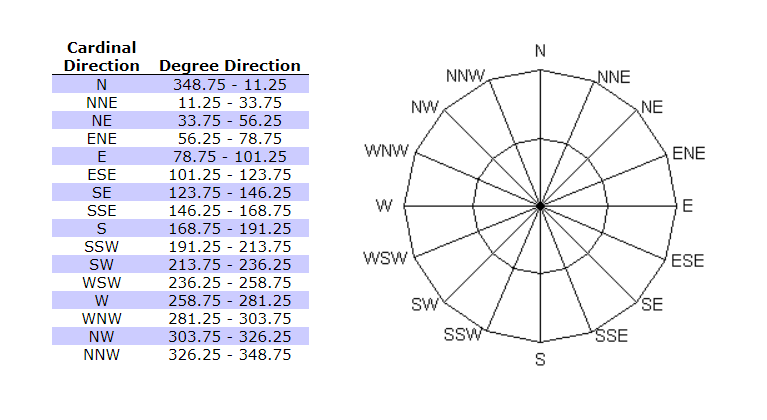

```{r setup, include = FALSE}
knitr::opts_chunk$set(include = TRUE, echo = TRUE, warning = FALSE)
```

## **1. The Data Set** 

### **1.1. Procuring the data**

In order to study the ways in which our country's weather has behaved in the
past years, we decided to look for a data set on different sources from the
Internet. Unfortunately, we have not found any data set containing the metrics
we need, therefore we decided to use a public API which would give us the
weather conditions in Romania in a set of locations and time periods we chose to
specify.

The period of time has been set to a daily basis from Jan 1st 2011, until Dec
31st 2021. This choice has been made due to financial limitations we encountered
on the API's part. In case that we had wanted to procure more data, more
requests would have been necessary to be made to the public API, exceeding the
threshold of free requests.

For each request, the API will return a single *.csv* file, respecting the name
convention **weather_YEAR_COUNTY.csv**. So, for 41 Romanian counties and 11 years,
we would obtain 451 csv files. However, we need to work with a single data set,
so we decided to merge all of them into a single one in the code block below.

```{r}
library(tidyverse)
library(ggplot2)

# TRUE only at first when "weather_2011-2021_Romania.csv" is not present in our project
MERGE_ALL_DATASETS = FALSE

if (MERGE_ALL_DATASETS) {
  
  filenames_list = list.files(
    path = "../weather_data/",
    pattern = "*.csv",
    full.names = TRUE
  )
  
  data = lapply(filenames_list, read_csv) %>% bind_rows()
  
  write.csv(data, "weather_2011-2021_Romania.csv", row.names = FALSE, na = "")
} 

data = read_csv("weather_2011-2021_Romania.csv", show_col_types = FALSE)
```

### **1.2. The data set's columns**

***TODO:*** Describe the meaning of each relevant column using [this documentation](https://www.visualcrossing.com/resources/documentation/weather-data/weather-data-documentation/)

## **2. Cleaning the Data Set**

The data set we obtained is mostly in a good shape. However, on a quick scan, we
identified a few aspects that required some attention before diving into the
exploratory analysis (e.g. splitting complex columns into multiple simpler
ones).

In order to add value to the data set, we also decided to do some feature
engineering, and create additional columns that would enhance the diversity
of the data types. This diversity will allow for creating new types of plots
and open multiple questions with possibly more surprising insights in the
Romanian weather.

We start by removing blank spaces from column names for easier writing of the R
code (e.g. "Minimum Temperature" becomes "MinimumTemperature").
```{r}
names(data) = gsub(' ', '', names(data))
```


### **2.1. Splitting the Weather Type column**

The data set contains a column named *Weather Type* that contains a string of
different conditions identified at a specific time and location, each condition
being separated by a comma. However, there can be multiple conditions reported
in a day, so we decided that, instead of having a single column describing all
of the conditions, we could create a separate column for each weather type.

As a result, all of these new columns will be of boolean type, describing
whether the weather has been or not identified in the given condition. There
are 37 possible weather types in the data set, therefore 37 new columns will be
created.

```{r}
accumulate_weather_func = function(accumulated_types, weather) {
  if (!is.na(weather)) {
    conditions = strsplit(weather, ", ")[[1]]
    accumulated_types = union(accumulated_types, conditions)
  }
  
  return(accumulated_types)
}

# Compute the list of possible weather types in this data set
weather_types = reduce(data$WeatherType, accumulate_weather_func, .init = c())

cat("Number of possible weather types:", length(weather_types))

# Create the weather type columns
for (weather_type in weather_types) {
  column_name = gsub('[ /]', '', weather_type)  # remove spaces and slashes
  
  data[[column_name]] = with(
    data, 
    # If Weather is NA, then new column will contain NA as well
    if_else(
      is.na(WeatherType),
      NA,
      # If Weather is defined, check that condition is present => set TRUE/FALSE
      if_else(
        grepl(weather_type, WeatherType, fixed = TRUE),
        TRUE,
        FALSE
      )
    )
  )
}

# Display an example of some weather columns
data %>%
  slice(42:46) %>%
  select(c(WeatherType, Fog, LightRain, SnowShowers, Duststorm))
```


### **2.2. Categorizing the Wind Direction**

As the data is currently offered, the wind direction is expressed as a real
number, whose value ranges between 0 and 360 degrees. We can express this value
under a categorical form, by assigning a named direction for each specific
division on the trigonometric circle. In this way, we can obtain 16 different
categories for 16 subdivisions, as can be checked in the figure below.

```{r}
wind_direction_table = data.frame(
  "Cardinal_Point" = c("N", "NNE", "NE", "ENE", "E", "ESE", "SE", "SSE", "S", "SSW", "SW", "WSW", "W", "WNW", "NW", "NNW"),
  "From" = c(348.75, seq(11.25, 326.25, 22.5)),
  "To" = seq(11.25, 348.75, 22.5)
)
```



Using the above table, we can take each value from the *WindDirection* column
and build the new column *WindCardinalDirection*.

```{r}
# Break down the numeric direction into more categories
data = data %>%
  mutate(
    WindCardinalDirection = cut(
      x = WindDirection,
      breaks = c(0, wind_direction_table$To, 360),
      labels = c(wind_direction_table$Cardinal_Point, "N")
    )
  )

# Display an example of some wind directions
data %>%
  slice_sample(n=5) %>%
  select(c(WindDirection, WindCardinalDirection))

```


### **2.3. Categorizing the Visibility**

The data set presents a column called *Visiblity* that represents the distance,
measured in kilometers, at which an object or light can be clearly discerned.

As mentioned by the National Weather Service [at this location](https://www.weather.gov/safety/fog-boating), we can break down these
distances into 4 sets, creating a new column called *VisibilityLevel*, which
describes an ordered categorical variable.

The 4 divisions are described as being the following:

- **Very Poor** - Less than 0.5 nautical miles (< 0.926 Km)
- **Poor** - 0.5 to less than 2 nautical miles (0.926 Km - 3.704 Km)
- **Moderate** - 2 to 5 nautical miles (3.704 Km - 9.26 Km)
- **Good** - Greater than 5 nautical miles (> 9.26 Km)

```{r}
data = data %>%
  mutate(
    VisibilityLevel = cut(
      x = Visibility,
      breaks = c(0, 0.926, 3.704, 9.26, +Inf),
      labels = c("Very Poor", "Poor", "Moderate", "Good"),
      include.lowest = TRUE
    )
  )
  
# Display an example of some visibility levels
data %>%
  slice_sample(n=5) %>%
  select(c(Visibility, VisibilityLevel))
```

### **2.4. Rewriting the County names**

The column *Address* contains the name of each county seat in our country,
followed by **, Romania**, but we would like to have a column called *County*
that contains only the name of the county (not the county seat) to use while
plotting the Romania's map.

```{r}
romania_counties = c("Alba","Arad","Arges","Bacau","Bihor","Bistrita-Nasaud","Botosani","Brasov","Braila","Bucharest","Buzau","Caras-Severin","Calarasi","Cluj","Constanta","Covasna","Dambovita","Dolj","Galati","Giurgiu","Gorj","Harghita","Hunedoara","Ialomita","Iasi","Maramures","Mehedinti","Mures","Neamt","Olt","Prahova","Satu Mare","Salaj","Sibiu","Suceava","Teleorman","Timis","Tulcea","Vaslui","Valcea","Vrancea")
romania_county_seats = c("Alba Iulia","Arad","Pitesti","Bacau","Oradea","Bistrita","Botosani","Brasov","Braila","Bucharest","Buzau","Resita","Calarasi","Cluj-Napoca","Constanta","Sfantu Gheorghe","Targoviste","Craiova","Galati","Giurgiu","Targu Jiu","Miercurea Ciuc","Deva","Slobozia","Iasi","Baia Mare","Drobeta-Turnu Severin","Targu Mures","Piatra Neamt","Slatina","Ploiesti","Satu Mare","Zalau","Sibiu","Suceava","Alexandria","Timisoara","Tulcea","Vaslui","Ramnicu Valcea","Focsani")

# First create a column CountySeat and then, based on the above lists, create
# the final column County
data = data %>%
  mutate(CountySeat = gsub(', Romania', '', Address)) %>%
  mutate(County = plyr::mapvalues(
    x = CountySeat,
    from = romania_county_seats,
    to = romania_counties
  ))

# Display an example of several counties
data %>%
  slice_sample(n=5) %>%
  select(c(Address, CountySeat, County))
```

## **3. Breaking down the Weather**

### **3.1. Exploring the Temperatures**

<!-- This chapter is for Min Temp, Max Temp, Temp columns (3)
+ DateTime/Counties -->


### **3.2. Exploring the Humidity**

<!-- This chapter is for Dew point, Relative Humid, Heat Index columns (3)
+ DateTime/Counties -->


### **3.3. Exploring the Winds**

<!-- This chapter is for Wind Speed, Wind Gust, Wind Direction, Wind Chill,
Wind Cardinal Direction columns (5) + DateTime/Counties -->


### **3.4. Exploring the Precipitations and their effects**

<!-- This chapter is for Precip, Precip Cover, Snow Depth, Cloud Cover,
Visibility, Visibility Level, Sea level pressure columns (7) + DateTime/Counties

We can mention something like:

Maps of sea-level isobars help weather forecasters quickly spot areas of low
and high pressure, which can help them identify areas of potentially stormy
weather.
-->


### **3.5. Exploring the Weather Types**

<!-- This chapter is for all 37 weather types columns and relationships
between them + DateTime/Counties -->


## **4. Making sense of the Weather**

<!-- Here we will show relationships between all separated elements from above -->


### **4.1. Surface connections**

<!-- Correlation matrix between the main columns. Or between ALL of them.
Surprising results? Maybe new chapters from this? -->


### **4.2. Showcasing Weather Types by Temperature**


### **4.3. The links between Temperature and Humidity**


### **4.4. How powerful are Romania's storms?**

<!-- Look into links between Wind and Precipitations' many columns  -->


## **5. Conclusions**


# **What to do with this peace of code?**
```{r}
small_data = data %>% group_by(Address) %>% filter(row_number() == 1)
ggplot(small_data, aes(x=Latitude, y=Longitude)) + 
     geom_point(color="orange",
         fill="#69b3a2",
         shape=21,
         alpha=0.5,
         size=6,
         stroke = 2)+geom_text(
     label=rownames(small_data), 
     nudge_x = 0.25, nudge_y = 0.25, 
     check_overlap = T
   )
```
